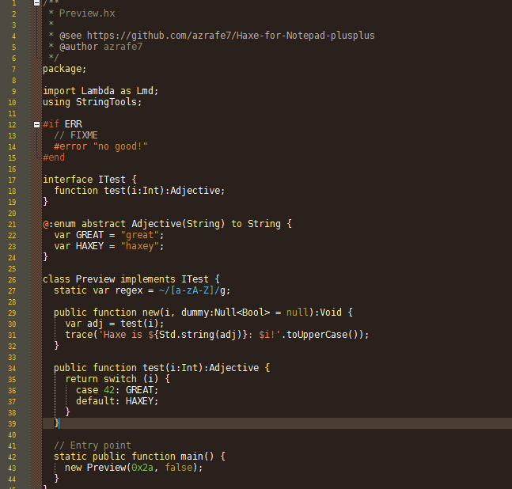

Haxe for Notepad++
==================

Syntax Highlighting for Haxe files in Notepad++ (UDL v2.1)

What's This Thing
-----------------
Just an xml file that gives you syntax highlighting/coloring for .hx files inside recent versions of [Notepad++](http://notepad-plus-plus.org) (the ones that support the [User Defined Language](http://ivan-radic.github.io/udl-documentation/ "User Defined Language")).

How to Use it
-------------
 - Download the [haxe.xml]() file
 - Open Notepad++
 - Go to  `Language -> Define your language...`,  click on  `Import...` and select the `haxe.xml` file you've downloaded
 - Close and restart Notepad++
 - Done

Notes
-----
The color scheme is purposedly built for the Bespin theme (a dark theme), but changing the colors should be quite easy.

Here's a preview of how it looks like:

Thanks to [@yellowafterlife](https://yal.cc/notepad-pp-syntax-highlighting-for-haxe-2/) for the original work, and to the contributors of [haxe-TmLanguage](https://github.com/vshaxe/haxe-TmLanguage/).

Use it however you like it. 

LICENSE (MIT)
-------------
See [LICENSE]().