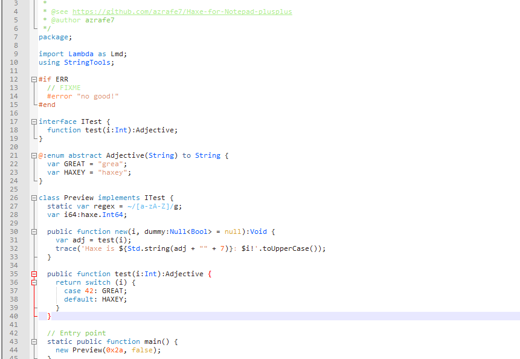

Haxe for Notepad++
==================

Syntax Highlighting for Haxe files in Notepad++ (UDL v2.1)

What's This Thing
-----------------
Just an xml file that gives you syntax highlighting/coloring for .hx files inside recent versions of [Notepad++](http://notepad-plus-plus.org) (the ones that support the [User Defined Language](http://ivan-radic.github.io/udl-documentation/ "User Defined Language")).

How to Use it
-------------
 - Download the [haxe.xml](haxe.xml) file (or [haxe-light.xml](haxe-light.xml))
 - Open Notepad++
 - Go to  `Language -> Define your language...`,  click on  `Import...` and select the `haxe.xml` file you've downloaded
 - Close and restart Notepad++
 - Done

Screenshots
-----
Here's a preview of how it looks like:

[haxe.xml](haxe.xml)

[haxe-light.xml](haxe-light.xml)

Thanks to [@yellowafterlife](https://yal.cc/notepad-pp-syntax-highlighting-for-haxe-2/) for the original work, and to the contributors of [haxe-TmLanguage](https://github.com/vshaxe/haxe-TmLanguage/).

UDL 2.1 Themer
--------------
You can customize the theme in the browser with this [little tool](https://rawgit.com/azrafe7/Haxe-for-Notepad-plusplus/master/themer/themer.html) (WIP).

Hint: ctrl+click on code in the preview panel to jump to the associated udl rule.

It works by mapping udl to css and back again (mappings are in `stylemap.haxe.json`).
The `preview.haxe.html` file is directly exported from Notepad++ (Plugins->NppExport->Export to HTML), and injected as is.
It can be used to live-preview other udl files using `stylemap.generic.json` ([example](https://rawgit.com/azrafe7/Haxe-for-Notepad-plusplus/master/themer/themer.html?stylemap=stylemap.generic.json&udl=udl.generic.xml&preview=preview.generic.html)) or writing a custom mappings file.

LICENSE (MIT)
-------------
See [LICENSE](LICENSE).